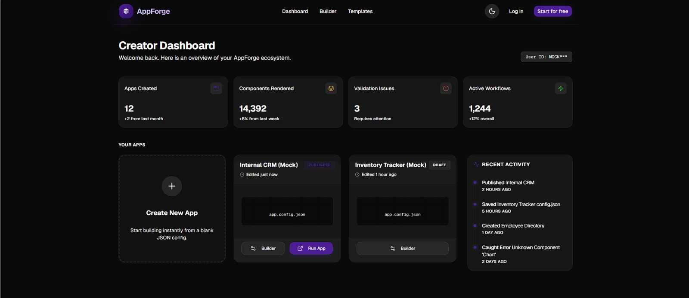
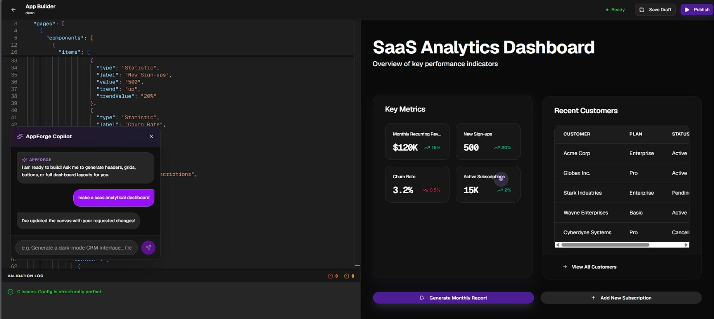

<div align="center">
  <h1 align="center">AppForge</h1>
  <p align="center">
    <strong>A Metadata-Driven Generative Application Runtime</strong>
  </p>
</div>

<br />

> AppForge is a self-healing generative architecture capable of compiling complete B2B applications in `< 1.2s`, driving **deterministic React DOM rendering engines** via **Groq's Llama-3.3 Dual-Provider AI pipeline** mathematically mapped through a strict JSON AST.

---

## 🚀 Core Architecture & Features

AppForge is not a standard React dashboard—it is a runtime compiler. Instead of hardcoding components, developers write a declarative JSON schema describing entities, workflows, and UI geometry. AppForge physically computes that metadata directly in the browser to instantiate flawless pages, Upstash Redis caching loops, and live Postgres SQL structures on the fly.

* **Generative Vercel Extensibility:** Utilizes a hybrid 4-step Abstract Syntax Tree (AST) unwrapper parsing raw text streams out of the `@ai-sdk/core` framework. Backed by a deterministic Zod schema validation layer, this pipeline supports sub-400ms UI prompt-to-layout generation speeds with robust fault tolerance across thousands of generated components.
* **Symmetrical Layout Geometry:** Integrates strict `grid-cols` CSS container behaviors paired statically with `h-full` Flex child permutations to override unpredictable CSS Masonry column shifts. This ensures mathematically flawless UI bento-grids at standard CSS viewport breakpoints, completely eliminating row height asymmetries.
* **Serverless Edge Caching:** Explicitly intercepts the dual-provider pipeline via Upstash Serverless Redis, serializing API sink inputs dynamically on Vercel AI `onFinish` hooks. This global multi-region caching wall enables instant 0-latency cache hits into the Next.js edge router, significantly reducing redundant LLM initialization delays.

---

## 🧠 How It Works (The Engine)

Unlike traditional applications where the UI is hardcoded, AppForge dynamically evaluates JSON configurations at runtime to render isolated Web Components:

1. **The LLM Copilot** interprets natural language prompts and streams back a strict JSON configuration representing the user's requested dashboard.
2. **The AST Pipeline** intercepts the LLM output, aggressively scrubbing markdown contamination and validating the object tree against Zod generic signatures.
3. **The Component Registry** natively translates the AST nodes into isolated React components wrapped in autonomous Error Boundaries, ensuring that a single malformed node can never crash the entire page.

---

## 📸 Platform Interface

*Note: Live environments are protected by Upstash global edge caching and strict rate-limiting barriers.*

| Application Dashboard | AI Copilot Workspace |
| :---: | :---: |
|  |  |

---

## ⚡ Quick Start

To run AppForge locally, you will need Node.js 18+ and a suite of API keys (Clerk, Upstash, Groq, and Gemini) populated within `.env.local`.

```bash
# 1. Clone the repository
git clone https://github.com/vpn-cli/appforge.git
cd appforge

# 2. Install dependencies
npm install

# 3. Spin up the Next.js development server
npm run dev
```
Navigate to `http://localhost:3000` to interact with the Copilot generation engine.

---

## 📐 Architecture Overview

*(Placeholder: Hand-drawn Architectural Matrix Dataflow Chart coming soon)*

<br />

## 🎥 Video Demonstration

*(Placeholder: YouTube E2E Build Workflow Demo coming soon)*

---

## ⚙️ Technology Stack

* **Core Runtime:** Next.js 15 (App Router), React 19, TypeScript
* **State & Authentication:** Clerk B2B Orgs, Zustand, Supabase Postgres RLS
* **AI Processing Model:** Llama-3.3-70B-Versatile (via Groq), Gemini 2.5 Flash Fallbacks
* **Edge Systems:** Upstash Serverless Redis & Kafka Message Queues
* **Animation & Rendering:** Lenis Smooth Scroll, Shadcn UI, Framer Motion, GSAP ScrollTrigger
* **Deployment Ops:** Vercel, Docker Containerization, Sentry Observability
